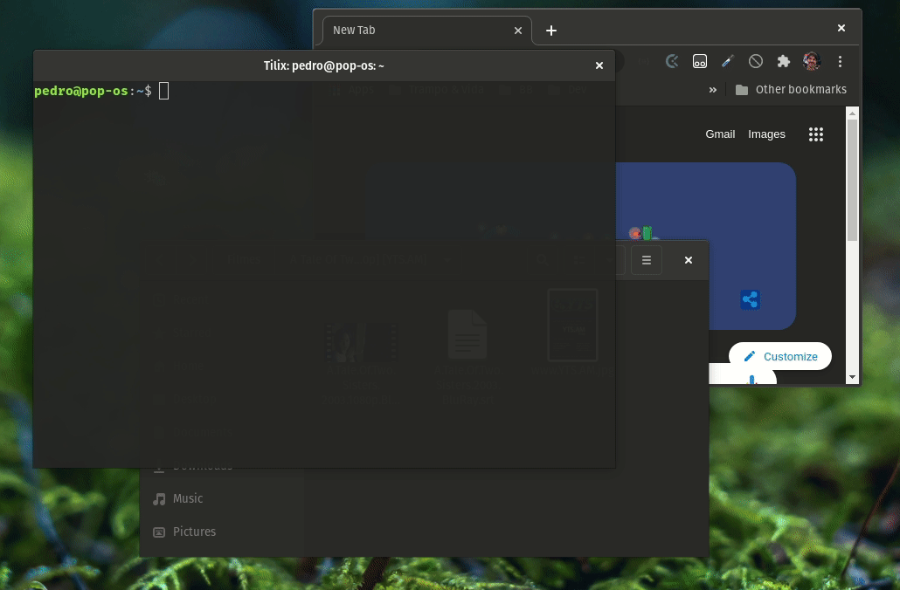

# This repo is being remodelled to "Cast to web". It can be used in a number of situations, eg: casting to TVs without Miracast, using the integrated browser. This readme will pass a reformulation shortly but the `npx` command is already poiting to the new repo and functional.

It will include more tutorials and support different video files to be a general tool to streaming video with subtitles easily.

# (PREVIOUS) Cast to Chromecast with subtitles

Linux has a bug that Chrome cannot cast the screen to Chromecast with sound (making casting VLC with subs not viable), so you need to cast a tab instead. This project creates an `express` server that streams video by chunks. It also converts `.srt` to `.vtt` to be included in the video as subs.

# Using

## With `npx`

- `npx pedropalhari/cast-to-web [filmpath].mp4 [subpath].srt`
- Open `http://localhost:8080` using Chrome and cast this tab to Chromecast.

## Without `npx`

- Clone this repo
- `yarn`
- `yarn build`
- `yarn start [filmpath].mp4 [subpath].srt`
- Open `http://localhost:8080` using Chrome and cast this tab to Chromecast.

Both filmpath and subpath must be absolute, they also should be `.mp4` and `.srt` in order.

## Demo

